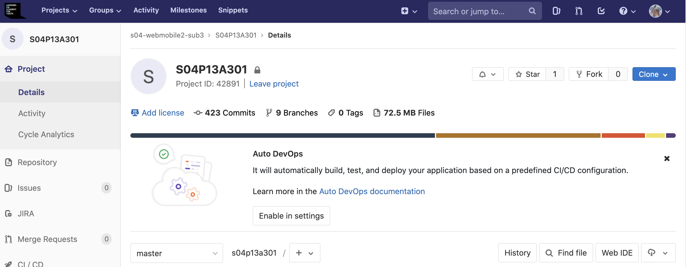
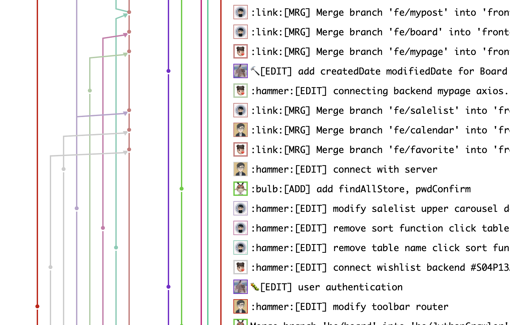
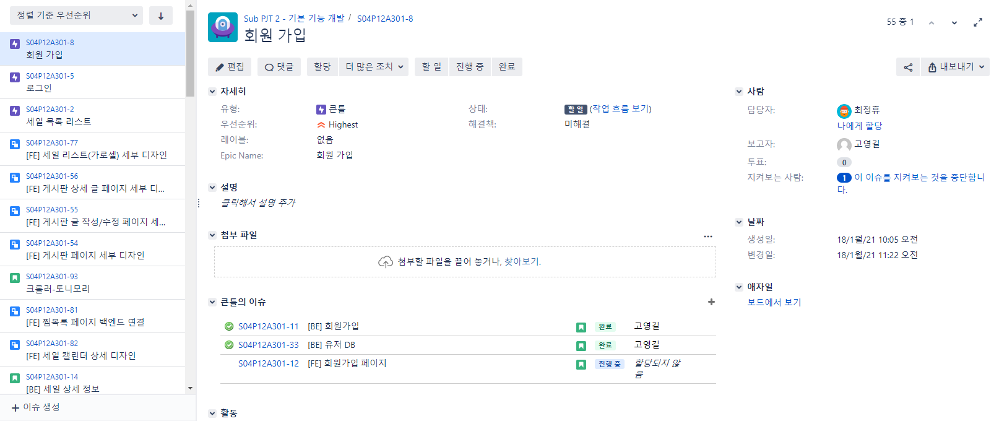
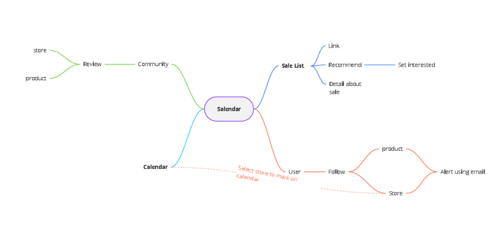
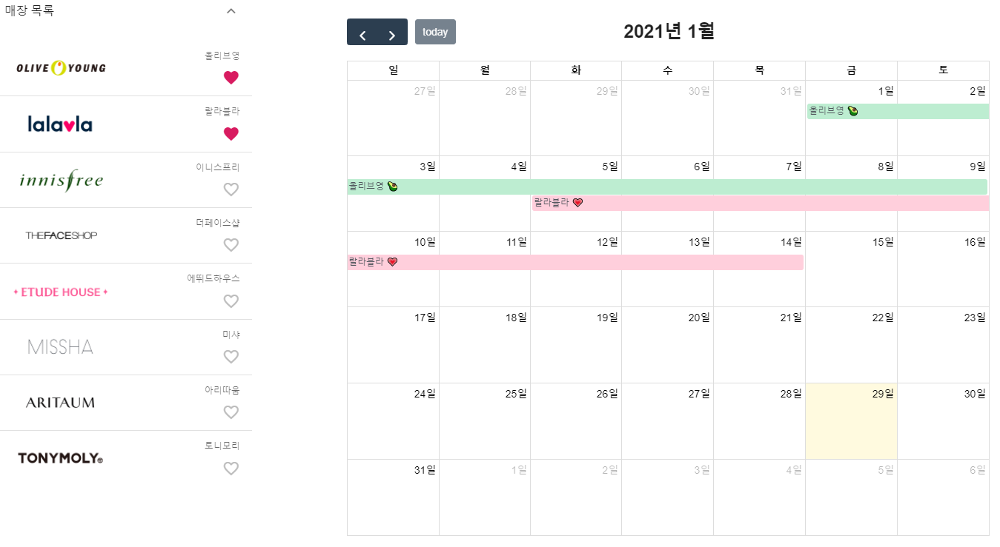
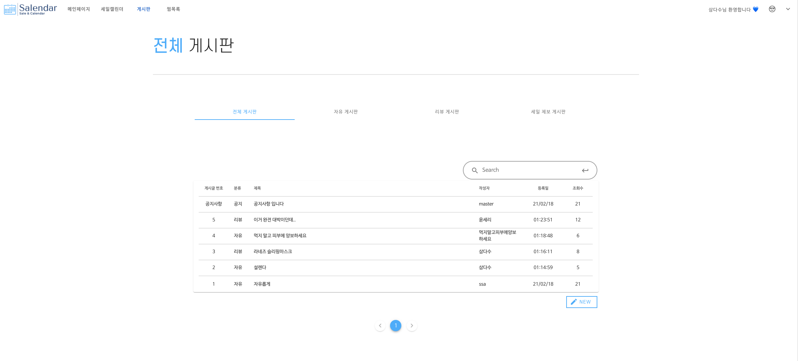
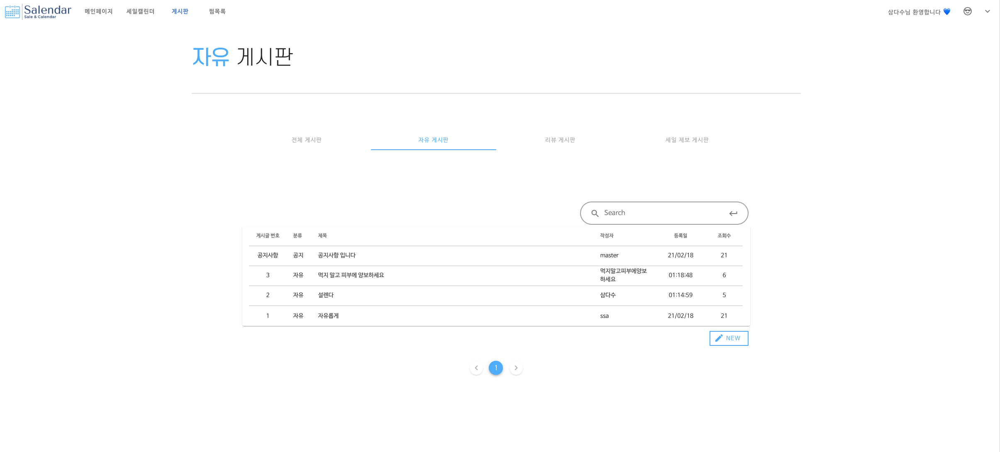
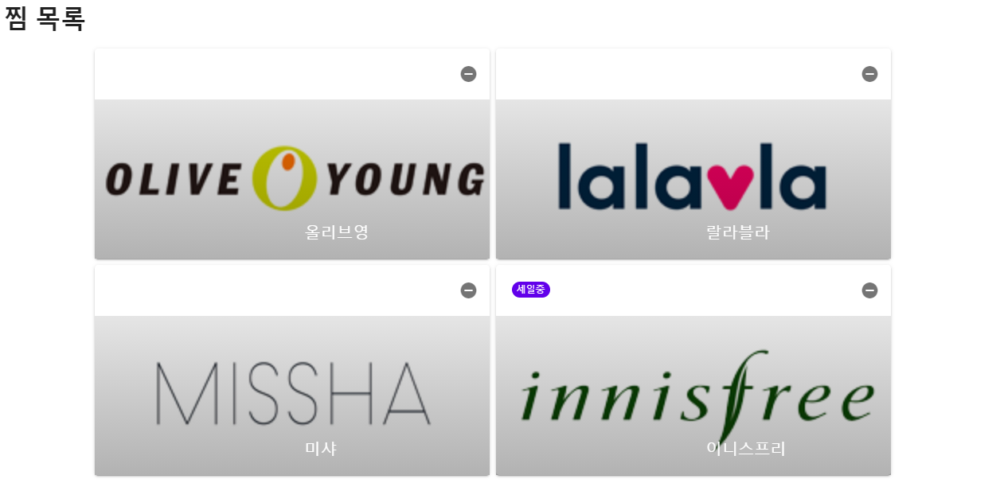

[TOC]

# 

> Maintainer: 최정휴, 고영길, 윤혜민, 김지영, 현성섭
>
> Sale 과 Calendar 를 합쳐서 Salendar


# Web Design Project - Salendar

## Stack

- Back-end

  - Spring boot, Jpa, Gradle, MariaDB

- Front-end

  - Vuejs

- Jira, Gitlab, Ubuntu, AWS

  

## Goal setting

> 아래 계획대로 기능을 구현하였습니다.

- 코스메틱 로드샵의 세일 정보 전달
  - 세일 일정이 담긴 캘린더 (매장, 월별로 필터링)
  - 세일 상세 정보 열람(링크, 세일 홍보 이미지)
  - 세일 알리미 - 팔로우중인 매장의 세일 정보를 메일로 전달
  - 자유 게시판, 리뷰 게시판, 세일 제보 게시판


## Plan

> 업무 분담
>
> - 백엔드: 고영길, 김지영
> - 프론트엔드: 윤혜민, 최정휴, 현성섭


### Gitlab

> Gitlab을 이용하여 코드 관리를 하였습니다. 1월 18일부터 2월 19일까지 총 426개의 커밋 및 9개의 브랜치가 있는 것을 확인할 수 있습니다.
> frontend와 backend를 나누고 그 아래로 기능별로 브랜치를 나누어 코드관리를 했습니다. master에는 배포를 위해 merge된 코드가 있습니다.






### Jira

> Jira를 이용하여 업무 분담된 Epic, Story를 모두 적고 매주를 스프린트로 구별하여 나누었습니다. 총 55개의 이슈를 작성하고 스프린트에 앞서 스토리 포인트, 담당자 할당 등을 진행 하고 있습니다.



### Mind Map

> 기능 정의를 위한 마인드맵



### ERD


```
# modeling

user
community
	Article
	Comment
sale
store
```


### Wireframe

> 주요 기능 와이어 프레임 정리
>
> https://docs.google.com/presentation/d/1fwJj-2fbSnexS-N7WqfDjFAD-sGmlYlO/edit#slide=id.p5


# Main results

## Key function

### 1. 메인페이지

> - 주요 드러그 스토어들의 세일 정보를 각각의 홈페이지에서 크롤링을 통해 이미지를 가져와서 한 눈에 보여지게 합니다.
> - 메인이 되는 할인 정보는 최상단에 공지합니다.
> - 진행 중인 세일 / 진행 예정 세일 정보는 메인 세일 밑에 카드 형식으로 제공됩니다.

- 주요 세일들을 최상단에 공지
- 진행 중인 세일과 진행 예정 세일 정보를 카드 형식으로 배열


### 2. 세일캘린더

> - 드러그 스토어들의 세일 기간 및 정보를 달력의 형태로 한 눈에 확인할 수 있습니다.
> - 유저는 상단 매장 목록의 좋아요를 통해서 관심있는 매장을 캘린더에 추가 할 수 있습니다.
> - 캘린더에는 각 매장을 매장별 색상으로 구분하여 세일 기간을 손쉽게 확인할 수 있습니다.




### 3. 게시판

> - 이용자들의 자발적인 참여로 만들어지는 게시판으로 자유게시판 / 리뷰게시판 / 세일 제보 게시판 등으로 나누어 서비스가 제공됩니다.
> - 각각의 게시판마다 정해진 양식을 기반으로 글을 게시할 수 있어 이용자들이 쉽게 글을 작성하고 읽을 수 있게 합니다.






### 4. 찜목록

> - 사용자가 주로 이용하는 스토어를 찜하고 관리할 수 있는 페이지 입니다.
> - 찜을 할 수 있고 찜목록에서 제거할 수 있어서 관심매장을 쉽게 관리할 수 있습니다.




# Other

- Jwt token, spring security를 사용한 인증
-  ajax를 활용한 비동기 요청
- RESTful
- Selenium + Web Driver 을 이용한 세일 정보 크롤링